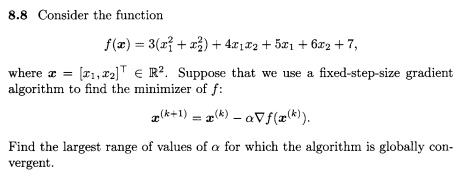
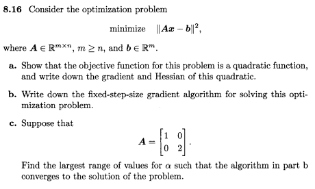
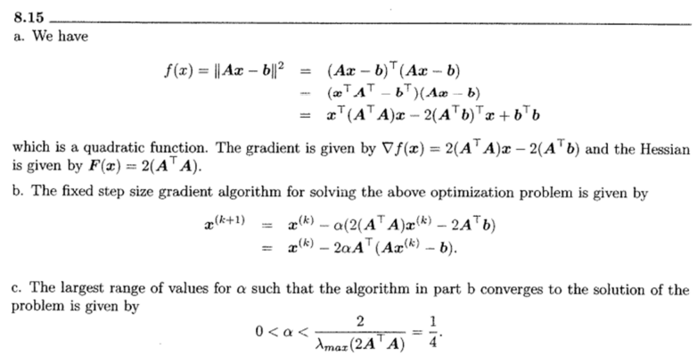
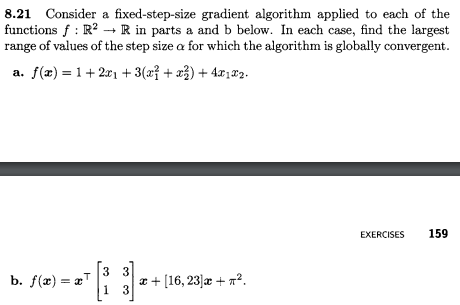
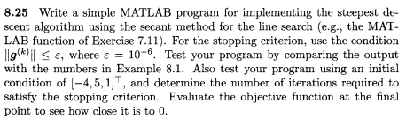
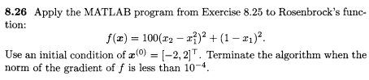
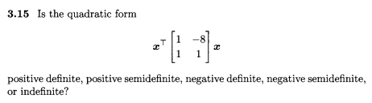
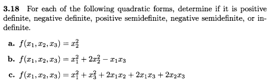

---
jupyter:
  jupytext:
    formats: ipynb,md
    text_representation:
      extension: .md
      format_name: markdown
      format_version: '1.3'
      jupytext_version: 1.12.0
  kernelspec:
    display_name: Python 3 (ipykernel)
    language: python
    name: python3
---

<!-- #region tags=[] -->
## CZ
### Exercise 8.8


Rewrite f as $f(\bold{x})=1/2\bold{x}^TQ\bold{x}-\bold{b}^T\bold{x}$


$$
\begin{align}
Q
&=
\begin{bmatrix} 
6 & 4 \\ 
4 & 6 
\end{bmatrix} 

\end{align}
$$
<!-- #endregion -->

```python
import sympy as sp
import numpy as np
from IPython.display import Markdown as md

x1,x2 = sp.symbols('x1,x2')

y = 3*(x1**2+x2**2)+4*x1*x2+5*x1+6*x2+7

print(sp.simplify(y))

Q = np.array(([6,4], [4,6]))
p = 1 + 1
v = np.linalg.eigvalsh(Q)
n = 10
md(f"$$ 0 \\lt \\alpha \lt {v[0]}/{v[1]}$$")

```

{{p}}
$$
0 \lt \alpha \lt {{p}}
$$

<!-- #region tags=[] -->
### Exercise 8.16



### Exercise 8.21

<!-- #endregion -->

```python tags=[]
import sympy as sp 
import numpy as np 
from IPython.display import Markdown as md

x1,x2 = sp.symbols('x1,x2')

f = 1 + 2*x1+3*(x1**2+x2**2)+4*x1*x2       

v = list(sp.ordered(f.free_symbols))

gradient = lambda f, v: Matrix([f]).jacobian(v)

Q = sp.hessian(f, v)
v = np.linalg.eigvalsh(np.array(Q).astype(np.float64))
md(f"$$ 0 \\lt \\alpha \lt {2}/{10}$$")
```

```python tags=[]
import sympy as sp 
import numpy as np 
from IPython.display import display, Markdown, Latex

x1,x2 = sp.symbols('x1,x2')
x = sp.Matrix(([x1], [x2]))


f = (sp.transpose(x) * sp.Matrix(([3,3],[1,3]))*x)[0] + sp.Matrix(([16,23])).dot(x) + np.pi**2
v = list(sp.ordered(f.free_symbols)) 

gradient = lambda f, v: sp.Matrix([f]).jacobian(v)
display(sp.hessian(f, v))
display(Markdown(f"$$ 0 \\lt \\alpha \lt {2}/{10}$$"))
```

### Exercise 8.25



### Exercise 8.26


```python
from scipy import optimize

def g1(x,y):
  return 100*(y-x**2)**2+(1-x)**2

x0 = -2
y0 = 2
root = optimize.newton(g1, x0, full_output=True, disp=True, args=(y0,), maxiter=100000)
root
```

### Exercise 3.15



```python
import numpy as np

Q = np.array(([1,-8], [1,1]))

np.linalg.eig(Q)


```

<!-- #region tags=[] -->
### Exercise 3.18

<!-- #endregion -->

```python
import sympy as sp 
import numpy as np 
from IPython.display import display, Markdown, Latex

x1,x2,x3 = sp.symbols('x1,x2,x3')
x = sp.Matrix(([x1], [x2], [x3]))

f1 = x2**2 + 0 *x1 + 0 * x3
f2 = x1**2+2*x2**2-x1*x3
f3 = x1**2+x3**2+2*x1*x2+2*x1*x3+2*x2*x3

v1 = list(sp.ordered(f1.free_symbols)) 
v2 = list(sp.ordered(f2.free_symbols))
v3 = list(sp.ordered(f3.free_symbols))

Q1 = sp.hessian(f1, v1)
Q2 = sp.hessian(f2, v2)
Q3 = sp.hessian(f3, v3)

display(Q1)
display(Q2)
display(Q3)

display(sp.Matrix(Q1).eigenvects())

display(sp.Matrix(Q2).eigenvects())

display(sp.Matrix(Q3).eigenvects())

```
